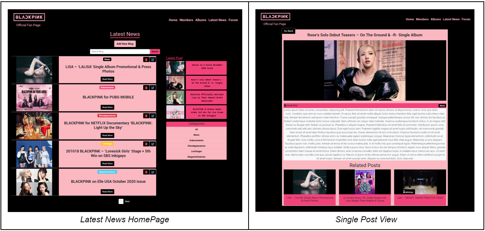
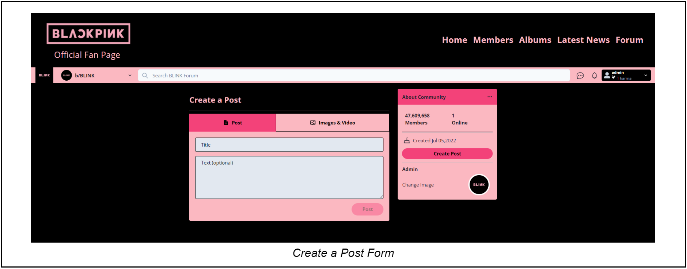
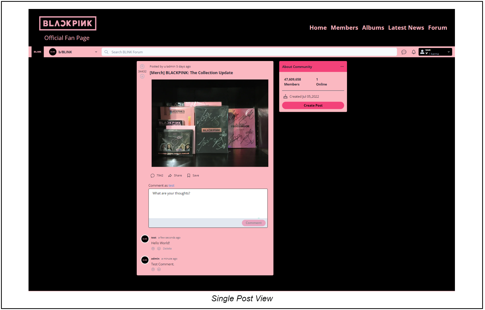

# Blackpink Fan Page - Full-Stack React Web Application

## Introduction

My full-stack web application is a fan site for a kpop group called “Blackpink”,
**the goal of this website is to act as a central information and social hub
where fans can share and interact with one another.** The key features of my
full-stack website are:

- ‘About Members’ page featuring biography, interesting facts, and social media
  links of each group member displayed using bootstrap accordions.
- ‘Albums’ page featuring a carousel using a package library called ‘React
  Elastic Carousel’, displaying the group’s albums in a bootstrap card element
  with album details and links to Spotify playlists.
- ‘Latest News’ page showcasing categorized news posts created by an admin user.
  Each post can either be edited or deleted. The uploaded image will be hosted
  on a cloud-based image and video management service website called
  ‘Cloudinary’.
- ‘Forum’ page works very similarly to Reddit where there are different
  communities for different topics. Some of the main features implemented are
  signup and login authentication, new communities and post creation, as well as
  commenting and voting on uploaded posts. For the backend, I’m using Google’s
  firebase for authentication, firestore database, and image storage.

## Design and Implementation

> The home landing page has a video background with the groups’ social links.
> And all the icons are clickable, for example clicking the Youtube icon will
> take you to Blackpink’s Youtube page.

---

> The ‘Members’ section is a static page showcasing the group members’
> biographies, interesting facts, and social media links all displayed using
> bootstrap accordions and personally themed using scss. Since all the data on
> this page are meant to stay static, I used a static database approach and
> stored all the data in a static array file called ‘BiographyData’.

---

> The ‘Albums’ page is a static page showcasing the group’s album collection.
> For the carousel, I used a package library called ‘React Elastic Carousel’ for
> its ease of use and excellent documentation. And similarly to the ‘Members’
> page, I stored all the data in a static array file called ‘AlbumsData’.

---

> The ‘Latest News’ page features three buttons only visible to the admin user,
> ‘Add New Blog’, ‘Delete’, and ‘Edit’. For all other users, 5 news posts sorted
> by date created are shown on each page. A ‘Latest Post’ section is shown
> displaying 4 of the most recently created post. There is also a search bar and
> a categories section to filter the blogs shown to the user’s preference. Each
> news post has an image, category tag, title, and a ‘Read More’ button to
> navigate the user to the full post. Clicking the ‘Read More’ button or one of
> the cards under the ‘Latest Post’ section will navigate the user to the full
> post view.

---

> The administrator user can create new posts by clicking the ‘Add New Blog’
> button and the user will be navigated to an ‘Add Blog’ form where the user
> must add a title, body/description, upload an image and select a category. All
> elements of the form must be filled out before submission. When the ‘Edit’
> button is clicked the user will be navigated to an ‘Edit Blog’ form, similar
> to the ‘Add Blog’ form but this time all fields are filled out with the
> selected post current data. The image will not be changeable and that is why
> the image upload field is not shown here. When the ‘Delete’ button is clicked,
> an alert message will be prompted in the browser asking the user to confirm
> and if ‘ok’ is selected, the selected post will be deleted from the server.

---

> The Forum page is styled using Chakra UI to resemble Reddit’s layout. The user
> does not have to  
> have an account to view communities and posts but in order to be able to
> create or join communities  
> and upload a post or interact with other users by commenting, and voting on
> posts, they must have a registered account. When the user is logged in, the
> navbar will change to show the communities tab on  
> the left of the search button and to the right, messaging and notifications
> icons (currently not working), and a user banner with a dropdown with ‘profile
> view’ and ‘log-out’ options. Clicking on the  
> dropdown menu to the left of the search bar will display all the communities
> the user is moderating and subscribed to.

---

> Clicking on ‘Create Community will open a modal that has 2 inputs, one for the
> communities’ name and a checkbox to indicate the community type. On the
> community page, the top banner will show the community image and name with a
> ‘join’ or ‘joined’ button depending on if the user is subscribed to the
> community, and clicking the button will either let the user join or leave the
> community. Also if the user is the community creator, the user can change the
> community profile image under the ‘About Community’ section.

---

> Clicking on the ‘Create Post’ input field will navigate the user to the
> ‘/submit’ page displaying the ‘Create Post’ form where the user can add a post
> title with an optional text body and/or image. The uploaded image will be
> stored on the Firebase storage I have set up for this project.

---

> And finally, on every post, there is an upvote and downvote button with the
> current vote count, a reference to when the post was created, the post title,
> optional text body, and an image if present. Below that is the commenting
> section to allow the user to add comments to the post. The delete icon  
> is only visible to the user that created that specific post or comment, and
> clicking the icon will remove the post or comment from their perspective
> database collection.

---

## Market Survey

1. [YG Dreamers](https://ygdreamers.com) - WordPress fansite page with blog
   posts for recent news about Blackpink, separated by topics such as music,
   news, event, … etc.
2. [r/BlackPink](https://www.reddit.com/r/BlackPink) - Subreddit forum for
   Blackpink fans, subscribed users can contribute to the page with content such
   as images, text, videos, and links. All content on the site can be voted up
   or down by other members.
3. [BLACKPINK Members Profile](https://kprofiles.com/black-pink-members-profile) -
   Simple website acting as a Kpop database with Kpop and K celebrity profiles,
   similar to IMDb, for movies and actors.
4. [YG Entertainment Artist: Blackpink](https://www.ygfamily.com/artist/Main.asp?LANGDIV=E&ARTIDX=70) -
   Simple page on the YG entertainment company website about their artist
   Blackpink, has information about albums, and upcoming content from the group.
5. [Blackpink Music Shop](https://shop.blackpinkmusic.com/) - Official Blackpink
   merchandise site, showcases Blackpink theme colors, designs, and logos.
